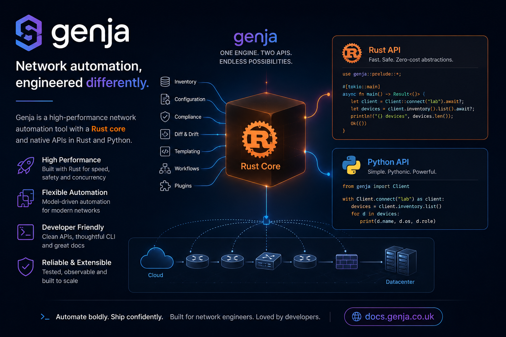

# Genja

Genja is a plugin-based automation framework for executing tasks across
multiple hosts.

Inspired by tools like Nornir, Ansible, and Salt, Genja brings the benefits of
static typing and native Rust concurrency to network automation. It provides
both Rust and Python APIs, allowing you to choose the right interface for your
use case while using the same underlying runtime.

## Key Features

- **Performance**: Concurrent host execution through a native Rust runtime
- **Type Safety**: Compile-time checks and validation through Rust's type system
- **Plugin Architecture**: Extensible design for inventory, transforms, runners, and tasks
- **Dual Language Support**: Native Rust API and Python bindings over the same runtime
- **Network-Ready**: Designed for network automation, but flexible enough for broader multi-host automation workloads

## Why Genja

Genja is aimed at teams that want more structure than ad hoc scripts and more
control than traditional YAML-first automation tools.

- **Rust-first core**: Strong typing, explicit task models, and native concurrency
- **Python access without a separate runtime design**: Python applications use the same core execution engine instead of a separate implementation
- **Composable plugin model**: Inventory, runners, processors, transforms, and connections are all extensible
- **Good fit for larger automation systems**: Useful when you need reusable task logic, predictable result structures, and programmatic integration

## Current Maturity

Genja is still in a testing stage, so you should expect some API refinement as
the project matures. The Rust ecosystem around Genja is also still small
compared with older Python-first automation tools, especially in the available
plugin surface and community integrations.

Use the installation guide to add Genja to a Rust or Python project, then use
the quickstart to load inventory and run your first task.

## Getting Started

- [Installation](installation.md)
- [Quickstart](quickstart.md)
- [Settings](settings.md)
- [Concepts](concepts.md)
- [Inventory](inventory.md)
- [Tasks](tasks.md)

## Reference

- [Plugins](plugins/index.md)
- [Transforms](transforms.md)
- [Connections](connection.md)
- [Processors](processors.md)
- [Runners](runners.md)
- [Examples](examples.md)
- [API Surface](api-surface.md)
- [Versions And Compatibility](version-compatibility.md)
- [Logging And Troubleshooting](logging-troubleshooting.md)

## Development

- [Contributing](contributing.md)
- [License](license.md)

## Licensing

Genja is licensed under `AGPL-3.0-only`. See [License](license.md) for package
license details.
